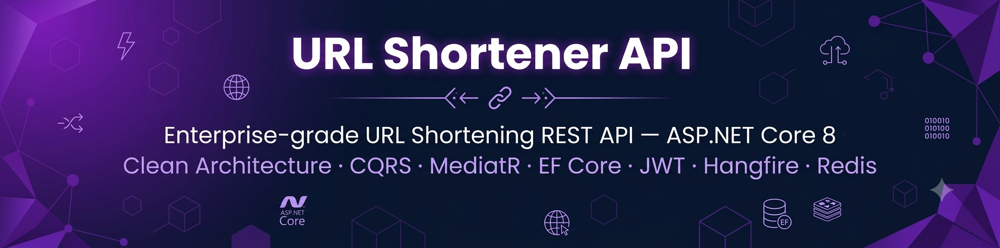
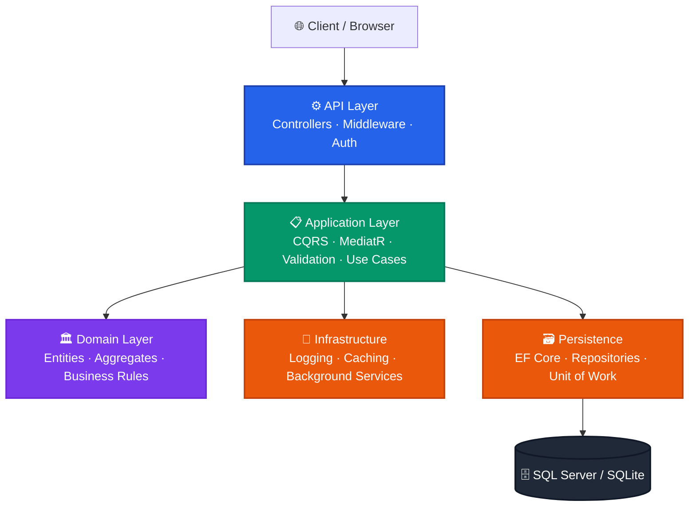
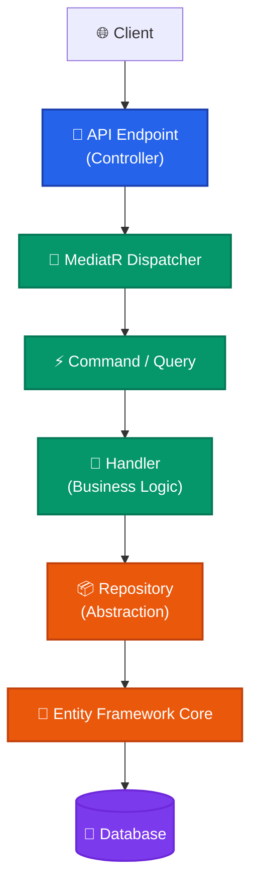
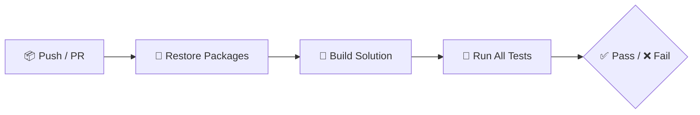

<p align="center">
  
</p>
<h1 align="center">🔗 URL Shortener API</h1>

<p align="center">
  <em>Enterprise-grade URL Shortening REST API — ASP.NET Core 8 · Clean Architecture · CQRS · MediatR · EF Core · JWT · Serilog · GitHub Actions</em>
</p>

<p align="center">
  
  
  
  
</p>

<p align="center">
  
  
  
  
</p>

<p align="center">
  
  
  
  
</p>

<p align="center">
  
  &nbsp;
  
  &nbsp;
  
  &nbsp;
  
</p>

---

## Table of Contents

- [Overview](#overview)
- [Key Features](#key-features)
- [Architecture](#architecture)
- [Solution Structure](#solution-structure)
- [Technology Stack](#technology-stack)
- [API Endpoints](#api-endpoints)
- [Security](#security)
- [Performance](#performance)
- [Health Checks](#health-checks)
- [Testing](#testing)
- [Running Locally](#running-locally)
- [Configuration](#configuration)
- [CI/CD](#cicd)
- [Screenshots](#screenshots)
- [Roadmap](#roadmap)
- [Engineering Practices](#engineering-practices)
- [License](#license)
- [Author](#author)

---

## Overview

The **URL Shortener API** is a production-ready, enterprise-grade RESTful service built with **ASP.NET Core 8**, following **Clean Architecture**, **CQRS**, and **Domain-Driven Design** principles.

This project serves as a comprehensive reference implementation demonstrating modern backend engineering practices — from JWT Authentication and CQRS with MediatR, to distributed caching, background services, comprehensive integration testing, and automated CI/CD pipelines.

---

## Key Features

| Domain | Capabilities |
|---|---|
| **Authentication & Identity** | JWT Bearer Tokens · User Registration · User Login · Protected Endpoints · Claims-based Access |
| **URL Management** | Create Short URLs · Custom Aliases · Update URLs · Delete URLs · URL Expiration |
| **URL Lifecycle** | Activate URLs · Deactivate URLs · User-specific URL Management |
| **Redirect Engine** | Fast URL Resolution · Click Tracking · Visit Logging · Expiry & Status Validation |
| **Analytics** | Total Click Count · Browser Statistics · OS Statistics · Recent Visits · Analytics Caching |
| **Performance** | In-Memory Cache · URL Cache · Analytics Cache · Optimized Queries · Pagination |
| **Reliability** | Health Checks · Background Cleanup Service · Global Exception Handling · Correlation IDs |
| **Observability** | Serilog Structured Logging · Health Endpoints · Rate Limiting |
| **Testing** | 29+ Integration Tests · xUnit · FluentAssertions · SQLite In-Memory Testing |
| **DevOps** | GitHub Actions CI · Automated Build, Restore & Test Pipeline |

---

## Architecture

The system strictly adheres to **Clean Architecture** with enforced layer boundaries and a unidirectional dependency rule.



### Request Flow



> **Dependency Rule:** Dependencies flow strictly inward. The Domain layer has zero external dependencies. Application depends only on Domain. Infrastructure and Persistence depend on Application — never the reverse.

---

## Solution Structure

```text
UrlShortener/
│
├── src/
│   ├── UrlShortener.API              # Presentation — Controllers, Middleware, Configuration
│   ├── UrlShortener.Application      # Use Cases — CQRS Commands, Queries, Handlers, Validators
│   ├── UrlShortener.Domain           # Core Business — Entities, Aggregates, Domain Rules
│   ├── UrlShortener.Infrastructure   # Cross-cutting — Logging, Caching, Background Services
│   └── UrlShortener.Persistence      # Data — EF Core Context, Repositories, Migrations
│
├── tests/
│   ├── UrlShortener.UnitTests        # Domain & Business Logic Tests
│   └── UrlShortener.IntegrationTests # End-to-End API Tests (SQLite In-Memory)
│
└── UrlShortener.sln
```

---

## Technology Stack

| Category | Technology |
|---|---|
| **Framework** | ASP.NET Core 8 |
| **Language** | C# 12 |
| **ORM** | Entity Framework Core 8 |
| **Database** | SQL Server / SQLite |
| **Architecture** | Clean Architecture |
| **Design Patterns** | CQRS · MediatR · Repository · Unit of Work |
| **Authentication** | ASP.NET Identity · JWT Bearer |
| **Validation** | FluentValidation |
| **Logging** | Serilog |
| **Caching** | IMemoryCache |
| **Background Services** | .NET Hosted Services |
| **API Documentation** | Swagger / OpenAPI |
| **Testing** | xUnit · FluentAssertions · SQLite In-Memory |
| **CI/CD** | GitHub Actions |

---

## API Endpoints

### Authentication

| Method | Endpoint | Description |
|:---:|---|---|
| `POST` | `/api/auth/register` | Register a new user account |
| `POST` | `/api/auth/login` | Authenticate and receive JWT token |

### URL Management

| Method | Endpoint | Description |
|:---:|---|---|
| `POST` | `/api/urls` | Create a new shortened URL |
| `GET` | `/api/urls` | Retrieve all URLs for authenticated user |
| `PUT` | `/api/urls/{id}` | Update an existing URL |
| `DELETE` | `/api/urls/{id}` | Delete a URL permanently |
| `PUT` | `/api/urls/{id}/activate` | Activate a deactivated URL |
| `PUT` | `/api/urls/{id}/deactivate` | Deactivate an active URL |
| `GET` | `/api/urls/{id}/analytics` | Retrieve analytics for a specific URL |

### Redirect

| Method | Endpoint | Description |
|:---:|---|---|
| `GET` | `/{shortCode}` | Resolve and redirect to the original URL |

### Health

| Method | Endpoint | Description |
|:---:|---|---|
| `GET` | `/health` | Returns system health status |

---

## Security

- ✅ JWT Bearer Token Authentication
- ✅ Claims-based Authorization Policies
- ✅ Secure Password Hashing (ASP.NET Identity)
- ✅ Protected Endpoints with `[Authorize]`
- ✅ API Rate Limiting to prevent abuse
- ✅ Secure Middleware Pipeline
- ✅ Global Exception Handling — no stack traces exposed

---

## Performance

- ✅ In-Memory URL Caching for fast redirect resolution
- ✅ Analytics Result Caching to reduce database load
- ✅ Background Cleanup Service for expired URL removal
- ✅ Optimized EF Core Queries with AsNoTracking
- ✅ Pagination support for large datasets

---

## Health Checks

The application exposes a health endpoint for infrastructure monitoring:

```
GET /health
```

| Check | Description |
|---|---|
| **Database** | Validates SQL Server / SQLite connectivity |
| **Memory** | Monitors application memory pressure |
| **Cache** | Validates IMemoryCache availability |

---

## Testing

The project includes a comprehensive automated test suite:

| Type | Count | Coverage |
|---|:---:|---|
| Integration Tests | 29+ | Auth, CRUD, Redirect, Analytics, Health |
| Unit Tests | — | Domain Logic, Validators |

Tests use **SQLite In-Memory** for fast, isolated database testing without external dependencies.

Run all tests:

```bash
dotnet test
```

---

## Running Locally

**1. Clone the Repository**

```bash
git clone https://github.com/chintanchhapgar/core.git
cd UrlShortener
```

**2. Restore Dependencies**

```bash
dotnet restore
```

**3. Build the Solution**

```bash
dotnet build
```

**4. Run the API**

```bash
dotnet run --project src/UrlShortener.API
```

**5. Access Swagger UI**

```
https://localhost:5001/swagger
```

---

## Configuration

Update `appsettings.json` with your environment values:

```json
{
  "ConnectionStrings": {
    "DefaultConnection": "Your_Database_Connection_String"
  },
  "Jwt": {
    "Issuer": "your-issuer",
    "Audience": "your-audience",
    "SecretKey": "your-secret-key-minimum-32-characters"
  },
  "Serilog": {
    "MinimumLevel": "Information"
  }
}
```

---

## CI/CD

GitHub Actions automatically runs on every **push** and **pull request**:



| Step | Description |
|---|---|
| **Restore** | Restores all NuGet packages |
| **Build** | Compiles the entire solution |
| **Test** | Executes all unit and integration tests |

---

## Screenshots

<p align="center">
  
  <br/>
  <em>Swagger API Documentation</em>
</p>

<br/>

<p align="center">
  
  <br/>
  <em>System Health Monitoring</em>
</p>

<br/>

<p align="center">
  
  <br/>
  <em>URL Analytics Dashboard</em>
</p>

<br/>

<p align="center">
  
  <br/>
  <em>GitHub Actions CI/CD Pipeline</em>
</p>

---

## Roadmap

| Feature | Status |
|---|:---:|
| Docker Support | 📅 Planned |
| Redis Distributed Cache | 📅 Planned |
| Refresh Token Support | 📅 Planned |
| PostgreSQL Support | 📅 Planned |
| Azure Deployment | 📅 Planned |
| Kubernetes Support | 📅 Planned |
| OpenTelemetry Integration | 📅 Planned |
| Prometheus Metrics | 📅 Planned |
| Email Verification | 📅 Planned |

---

## Engineering Practices

- ✅ Clean Architecture with strict layer separation
- ✅ CQRS Pattern (Commands & Queries via MediatR)
- ✅ Repository & Unit of Work Pattern
- ✅ Domain-Driven Design (DDD) concepts
- ✅ Dependency Injection throughout
- ✅ SOLID Principles
- ✅ JWT Authentication & Authorization Policies
- ✅ Background Services for automated cleanup
- ✅ In-Memory Caching Strategy
- ✅ Structured Logging & Observability (Serilog)
- ✅ Global Exception Handling Middleware
- ✅ API Rate Limiting
- ✅ Health Check Endpoints
- ✅ Integration & Unit Testing
- ✅ Automated CI/CD via GitHub Actions

---

## License

This project is licensed under the **MIT License** — see the [LICENSE](LICENSE) file for details.

---

## Author

<p align="center">
  <strong>Chintan Chhapgar</strong>
  <br/><br/>
  <a href="https://github.com/chintanchhapgar">
    
  </a>
  &nbsp;
  <a href="https://www.linkedin.com/in/chintanchhapgar/">
    
  </a>
</p>

---

<p align="center">
  <sub>Built with precision · Engineered for scale · Designed for clarity</sub>
</p>
